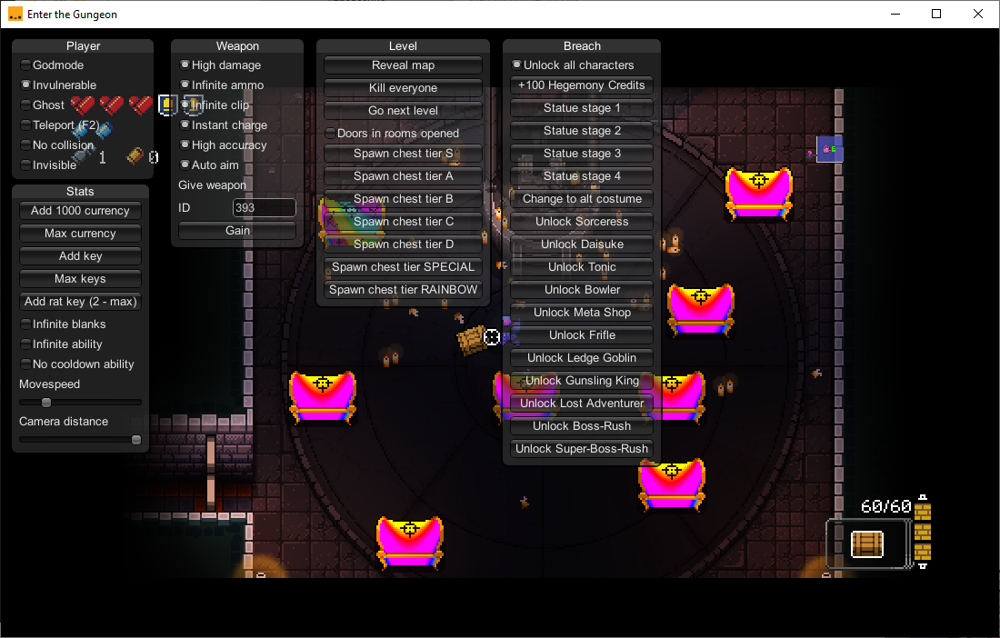

# EtGModMenu
EtGModMenu is a Cheat Menu for Enter The Gungeon.
## Disclaimer
This project is for Educational Use only. I do not condone this software being used to gain an advantage against other people. This mod was made for my university project.
## Usage
### First way
1. Add 0Harmony.dll to \EnterTheGungeon\EtG_Data\Managed folder of the game.
2. Inject EtGModMenu.dll via [SharpMonoInjector](https://github.com/warbler/SharpMonoInjector) (recommended) or any other mono injector with the following options:
- Namespace = EtGModMenu
- Class = Loader
- Method = Init
### Second way
Inject 0Harmony.dll and EtGModMenu.dll using my [ModLoader](https://github.com/Sacracia/ModLoader)
### In-game
Back quote to show / hide menu.
## Mod options / Screenshot

   

## ACHTUNG!
- Use F2 to teleport to cursor with Teleport enabled
- Max rat keys = 2
- Auto aim + Teleport = Teleport to enemy
- Find weapon id [here](https://gungeongod.com/)
- Dont use Kill Everyone on bosses
- After Unlock all characters or changing Statue reenter the breach
- Change to alt constume works only in breach
